# 🧠 Gisbel: Next-Gen Cognitive AI Therapy Platform

Gisbel is a local-first and hyper-personalized digital health ecosystem that uses Advanced RAG (Retrieval-Augmented Generation) architecture and Multi-LLM Orchestration to understand human psychology.

## 🌟 Vision and Engineering Approach

Unlike traditional chatbots, Gisbel is built on the principle of "Cognitive Continuity". It uses an AI Memory Network that remembers not just what the user says in the moment, but also their past emotional states, dream symbols, and behavioral patterns.

The project is designed to be scalable with microservices architecture running on Deno Edge Functions, semantically intelligent with PGVector, and end-to-end secure with Vault Architecture.

## 🏗️ System Architecture

Gisbel runs on an Event-Driven backbone. All communication between Frontend and Backend is managed via asynchronous events, ensuring the UI is never blocked.

```mermaid
graph TD
    Client[📱 React Native Client] -->|Log Event| DB[(Supabase PostgreSQL)]
    DB -->|Webhook Trigger| Orch[⚡ The Orchestrator]
    
    subgraph "🧠 Cognitive AI Engine"
        Orch -->|Route: dream_logged| DreamAI[🌙 Dream Analysis Service]
        Orch -->|Route: session_end| SessionAI[🎙️ Session Summarizer]
        Orch -->|Route: pattern_check| BehavioralAI[📊 Pattern Recognizer]
    end
    
    subgraph "🔍 RAG Knowledge Base"
        DreamAI <-->|Vector Search| VectorDB[💠 pgvector Store]
        SessionAI <-->|Context Retrieval| VectorDB
    end
    
    DreamAI -->|Async Result| DB
    SessionAI -->|Async Result| DB
    DB -->|Realtime Sub| Client
```



### 1. 🧠 Dual-Engine AI Core (Gemini 2.0 Flash & Pro)
Gisbel uses a hybrid model strategy to optimize cost and performance:
*   **⚡ Gemini 2.0 Flash:** Used for real-time chat, instant sentiment analysis, and fast responses (<200ms latency).
*   **🧠 Gemini 2.0 Pro:** The "Reasoning" engine that kicks in for in-depth dream interpretation, behavioral pattern analysis, and weekly psychological reporting.

### 2. 📚 RAG & Semantic Memory (The Memory Lane)
Instead of standard database queries, Vector Space technology is used.
*   **Embedding Pipeline:** User journals and conversations are converted into 768-dimensional vectors using `text-embedding-004`.
*   **Semantic Retrieval:** When a user says "I feel tired", the system doesn't just look for the word "tired"; it finds records semantically close to it, such as "burnout", "insomnia", or "low energy" from 3 months ago, and provides them as context to the AI.

### 3. 🛡️ Secure Vault & Privacy Architecture
Data security is not a feature, but the foundation of the architecture.
*   **Offline-First:** User data is stored in an encrypted MMKV store on the device.
*   **Row Level Security (RLS):** Cryptographic access controls are enforced for every single row of data at the database level.
*   **Data Isolation:** Psychological data (Dreams, Journals) are kept in "Vault" tables isolated from identity information.

## 🚀 Tech Stack

### 📱 Frontend (Mobile Experience)
*   **Core:** React Native 0.76 (New Architecture Enabled)
*   **Platform:** Expo SDK 52 (Managed Workflow)
*   **Router:** Expo Router (File-based Navigation)
*   **State:** Zustand & TanStack Query (Optimistic Updates)
*   **Graphics:** React Native Skia & Reanimated 3 (60 FPS Animations)
*   **I18n:** i18next (Full Multi-Language Support)

### ☁️ Backend & Cloud (Serverless Infrastructure)
*   **Runtime:** Deno (Supabase Edge Functions)
*   **Database:** PostgreSQL 16 (with pgvector extension)
*   **Auth:** Supabase Auth (JWT & Secure Session Management)
*   **Monitoring:** Sentry (Distributed Tracing)

### 🤖 AI & ML Ops
*   **LLM Orchestration:** LangChain
*   **Models:** Google Gemini 2.0 Flash, Gemini 2.0 Pro
*   **Embeddings:** Google text-embedding-004

## 🧪 Quality Assurance

This project has been developed adhering to Test-Driven Development (TDD) principles. The codebase is protected against even the slightest logic error.

| Test Type | Tool | Scope | Status |
| :--- | :--- | :--- | :--- |
| Unit Tests | Jest | Services, Hooks, Helpers | ✅ %100 Coverage |
| Integration Tests | RN Testing Library | Component Interactions, Navigation | ✅ Passed |
| Static Analysis | ESLint, TypeScript | Type Safety, Code Style | ✅ Strict Rules |
| CI/CD | GitHub Actions | Automated Test & Build | ✅ Active |

## 📂 Developer's Guide (Critical Files)

For developers reviewing the project, here are the files that are the heart of the architecture:

*   `supabase/functions/_shared/services/rag.service.ts`: **What does it do?** Talks to the vector database, embeds texts, and finds the most relevant memories using cosine similarity.
*   `supabase/functions/orchestrator/index.ts`: **What does it do?** It is the traffic police of the entire system. It analyzes every Event falling into the database and decides which AI agent should run.
*   `services/vault.service.ts`: **What does it do?** Manages the encrypted storage of sensitive data on the local device and its secure synchronization with the cloud.
*   `app/(app)/transcripts.tsx`: **What does it do?** Contains complex UI state management, animated lists, and dynamic filtering logic.

## 🚦 Installation

1.  **Clone the Repository:**
    ```bash
    git clone https://github.com/barisgudul/therapy_new.git
    ```

2.  **Install Packages:**
    ```bash
    npm install
    npx expo prebuild # Required for native modules
    ```

3.  **Environment Variables:** Create a `.env` file and enter your Supabase keys.

4.  **Start:**
    ```bash
    npm run ios  # or npm run android
    ```

## 📜 License

This project is licensed under the MIT License.

**Developer:** Mehmet Barış Güdül

> Architecture designed for scale, privacy, and empathy.
